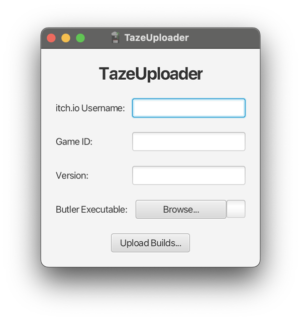

# TazeUploader
Batch upload tool for itch.io, made with JavaFX. Used, or will be used in all [Taze Adam Games](https://spacechuck.github.io/taze-adam/).\

## Usage
Download butler from [here](https://itchio.itch.io/butler). Login to butler with `butler login`\
Download the latest jar from [the releases page](https://github.com/SpaceChuck/tazeuploader/releases). Install Java if you dont have it and run the jar.\
\
Your builds should be named like this:\
`<Game Name>v<Version><Platform>.<Extension>`\
\
For example:\
`TazeAdamv2.2.2macOS.zip`\
`TazeAdam3Dv1.3Windows32.zip`\
`Annoyingv1.2.6Android.apk`\
\
You can see the full list of supported platforms [here](Platforms.md).\
\
**itch.io Username:** The account that you used to log in to butler.\
**Game ID:** Project URL of the game.\
**Game Name:** Name of the game that is used in the build names.
**Version:** Versions of the build that is also used in the build names.\
\
After filling out all these fields, select the butler executable and upload the builds with the **Upload Builds** button.